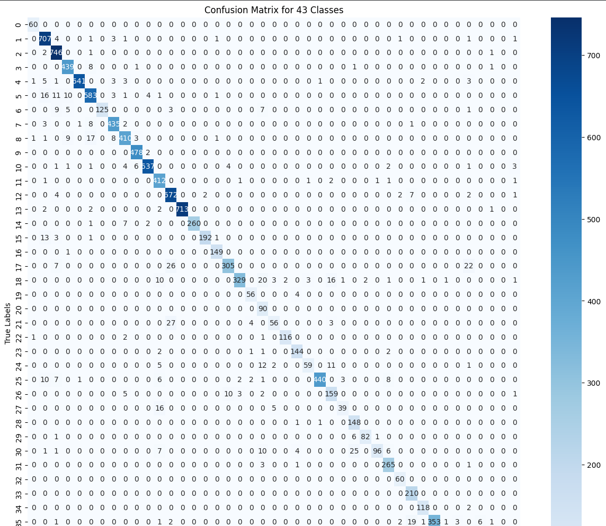
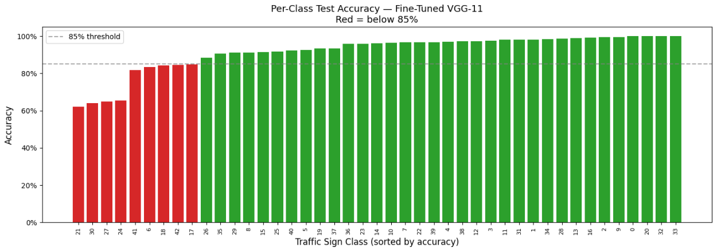

# VGG-11 Traffic Sign Classifier — Transfer Learning & Adversarial Robustness

Fine-tuning a pretrained VGG-11 on the German Traffic Sign Recognition Benchmark (GTSRB), with adversarial analysis applied to understand where the model breaks — the same threat-modeling mindset from [ADVERSA](https://github.com/sassom2112/ADVERSA), now in the image domain.

Traffic sign classifiers are safety-critical. A model that hits 93% accuracy on clean data can still be fooled by a perturbation invisible to the human eye. This project uses the two-phase transfer learning process as a controlled experiment, then attacks the result with FGSM to find the exploitable epsilon range.

---

## Results

| Phase | Val Accuracy | Test Accuracy | Notes |
|---|---|---|---|
| Phase 1 — Feature extraction | 84.2% | 63.9% | ImageNet backbone frozen, classifier only |
| Phase 2 — Full fine-tuning | 98.5% | **93.2%** | All layers unfrozen |

The 29-point test accuracy gap between phases is the core finding: frozen ImageNet features transfer well within-distribution (val) but generalize poorly to the held-out test split. Full fine-tuning closes that gap entirely, confirming the GTSRB visual domain is meaningfully different enough from ImageNet to require full gradient flow.

**Dataset:** GTSRB — 43 traffic sign classes, 39,270 images (19,980 train / 6,660 val / 12,630 test)

---

## What's in the Notebook

### 1. Two-Phase Transfer Learning
- **Phase 1** — frozen VGG-11 backbone, only classifier trained (10 epochs, ~15 min)
- **Phase 2** — full fine-tuning with all layers unfrozen (10 epochs, ~24 min)
- Training curves (loss + accuracy) across train / val / test for both phases

### 2. Confusion Matrix + Classification Report
Full 43-class confusion matrix with per-class precision, recall, and F1 from `sklearn.metrics.classification_report`.



### 3. Per-Class Accuracy Breakdown
Bar chart sorted by per-class test accuracy, highlighting classes below 85%. Identifies which traffic sign categories are most error-prone — a prerequisite for targeted adversarial analysis.



### 4. GradCAM — What the Network Sees
Manual GradCAM implementation using PyTorch hooks on the last convolutional layer. Weights feature maps by gradient magnitude and overlays the activation heatmap on the input image. Shows which spatial regions actually drive predictions.


### 5. FGSM Adversarial Examples
Side-by-side comparison of clean signs vs. perturbed versions at ε = 0.02, 0.05, 0.1. Shows exactly which images flip from correct to wrong prediction and at what perturbation strength.

### 6. Adversarial Robustness Curve
Accuracy vs. epsilon across ε = [0, 0.005, 0.01, 0.02, 0.05, 0.1, 0.15, 0.2, 0.3]. Produces the standard robustness degradation plot — the same format used in adversarial ML literature to characterize model vulnerability.

---

## Architecture & Training

**Model:** VGG-11 pretrained on ImageNet, classifier head replaced to output 43 logits.

**Loss:** CrossEntropyLoss | **Optimizer:** Adam (lr=0.001) | **Scheduler:** ExponentialLR (γ=0.95) | **Input:** 224×224

---

## Setup

```bash
pip install torch torchvision numpy matplotlib scikit-learn seaborn
```

Dataset downloads automatically from GTSRB on first run. Designed to run on Colab (GPU required for reasonable training time).

Open: [Adapting_and_Training_VGG_11_for_Traffic_Sign_Recognition.ipynb](Adapting_and_Training_VGG_11_for_Traffic_Sign_Recognition.ipynb)

---

## Roadmap

- [ ] PGD (projected gradient descent) attack — stronger iterative adversarial baseline
- [ ] Adversarial training — retrain with FGSM-augmented batches, remeasure robustness curve
- [ ] Class-targeted attacks — find minimal ε to flip a stop sign to a speed limit sign specifically
- [ ] Physical-world framing — map findings to Eykholt et al. (2018) stop sign attack methodology
